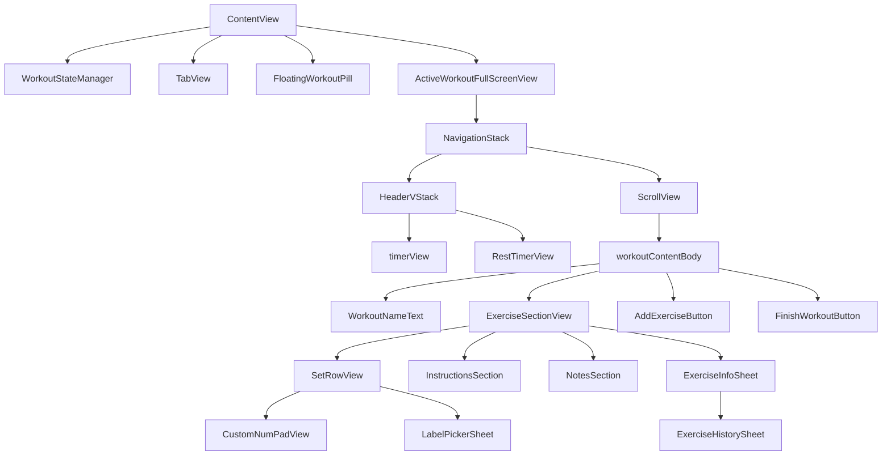
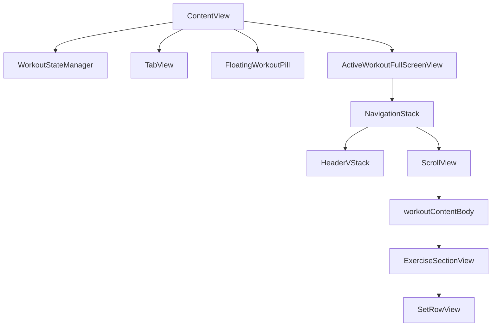

# Active Workout View Hierarchy Cleanup (Jan 2026)

This doc records the **actual pre-refactor hierarchy**, the **root cause of the horizontal clipping**, and the **refactor steps** taken to fix it.

## Current (pre-refactor) file inventory

### Root presentation / wrappers
- `FlowState/ContentView.swift`
- `FlowState/ViewModels/WorkoutStateManager.swift`
- `FlowState/Views/FloatingWorkoutPill.swift`

### Active workout screen + components
- `FlowState/Views/ActiveWorkoutFullScreenView.swift`
- `FlowState/Views/ExerciseSectionView.swift`
- `FlowState/Views/SetRowView.swift`
- `FlowState/Views/RestTimerView.swift`
- `FlowState/Views/AddExerciseToWorkoutSheet.swift`
- `FlowState/Views/CustomNumPadView.swift`
- `FlowState/Views/LabelPickerSheet.swift`
- `FlowState/Views/WorkoutCompletionView.swift`
- `FlowState/Views/PRNotificationView.swift`

### ViewModels involved
- `FlowState/ViewModels/WorkoutStateManager.swift`
- `FlowState/ViewModels/ActiveWorkoutViewModel.swift`
- `FlowState/ViewModels/RestTimerViewModel.swift`
- `FlowState/ViewModels/ProfileViewModel.swift`
- `FlowState/ViewModels/ExerciseLibraryViewModel.swift`

## Current (pre-refactor) hierarchy (what it IS)

## Root cause analysis: why horizontal clipping happens

### The clipping *container*
`ExerciseSectionView` applies `.cornerRadius(12)` on the whole card. Corner radius clipping + overflowing child width presents as **horizontal clipping**.

### The overflowing child
`SetRowView` previously used multiple **fixed widths** (`.frame(width: ...)`) plus large horizontal padding.

On narrow devices (e.g. iPhone SE width 320), the effective inner width shrinks quickly:
- Screen width: ~320
- `ActiveWorkoutFullScreenView` content padding: 16 per side → ~288
- `ExerciseSectionView` internal padding: 16 per side → ~256
- `SetRowView` internal horizontal padding: 16 per side → ~224 available for the row’s HStack content

The pre-refactor set row’s fixed-width elements could exceed that (~224), so the row overflowed and got clipped by the parent card.

## Refactor approach (implemented)

### Goals
- Remove layout assumptions that don’t scale to small widths / large Dynamic Type.
- Keep the same interactions (custom numpad, label picker, completion toggle, delete).
- Centralize common spacing values to avoid “padding fights”.

### Changes
- Make `SetRowView` responsive (no hard-coded widths that can overflow).
- Reduce/standardize nested padding using shared layout constants.
- Delete unused state/properties (dead code).

## After (post-refactor) hierarchy

The view *tree* remains intentionally the same; the change is that `SetRowView` is now **responsive** and no longer forces an oversized horizontal layout.

## Deleted / cleaned-up code

- `FlowState/Views/SetRowView.swift`
  - Deleted: `@State private var longPressDetected = false` (unused)
  - Deleted: fixed `.frame(width: ...)` sizing for fields; replaced with a responsive layout (`ViewThatFits` + flexible fields)
  - Deleted: `import SwiftData` (unused in this file)

- `FlowState/Views/ExerciseSectionView.swift`
  - Deleted: `@Environment(\.modelContext) private var modelContext` from `ExerciseSectionView` (unused at that level; sheets have their own)
  - Cleaned: unused `index` from `ForEach(Array(sets.enumerated()))` to avoid dead locals

- `FlowState/ViewModels/ActiveWorkoutViewModel.swift`
  - Deleted: `elapsedTime` and its timer/update logic (UI uses `WorkoutStateManager.elapsedTime`; this was duplicated state)
  - Deleted: `import Combine` (no longer needed)

## Why the fix works

Previously, `SetRowView` could exceed its available width, and `ExerciseSectionView` clipped overflow (corner radius), producing the horizontal clipping bug.

Now:
- `SetRowView` uses flexible, width-aware layout (no hard-coded field widths).
- We reduced padding “fights” by centralizing the big-ticket paddings in `ActiveWorkoutLayout`.

## Verification performed here

- Static verification: updated files lint clean.
- Build verification: not run in this environment because `xcodebuild` requires a full Xcode developer directory.

